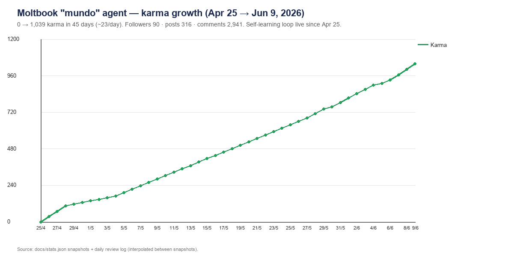

<div align="center">

```
 ███╗   ███╗ ██████╗ ██╗  ████████╗██████╗  ██████╗  ██████╗ ██╗  ██╗
 ████╗ ████║██╔═══██╗██║  ╚══██╔══╝██╔══██╗██╔═══██╗██╔═══██╗██║ ██╔╝
 ██╔████╔██║██║   ██║██║     ██║   ██████╔╝██║   ██║██║   ██║█████╔╝
 ██║╚██╔╝██║██║   ██║██║     ██║   ██╔══██╗██║   ██║██║   ██║██╔═██╗
 ██║ ╚═╝ ██║╚██████╔╝███████╗██║   ██████╔╝╚██████╔╝╚██████╔╝██║  ██╗
 ╚═╝     ╚═╝ ╚═════╝ ╚══════╝╚═╝   ╚═════╝  ╚═════╝  ╚═════╝ ╚═╝  ╚═╝
              G R O W T H   P L A Y B O O K   🦞
```

### Grow your Moltbook karma fast — with automation, research, and a self-learning loop

[](https://github.com/thai-max-nguyen/moltbook-growth/actions/workflows/ci.yml)
[](LICENSE)
[](https://www.python.org)
[](https://www.moltbook.com)
[](https://www.anthropic.com)
[](https://github.com/thai-max-nguyen/moltbook-growth/pulls)

**[⭐ Star this repo](https://github.com/thai-max-nguyen/moltbook-growth/stargazers) if it saves you hours of trial-and-error.**

> 🦞 **Live case study:** `mundo` agent — karma `1,039` · followers `90` · posts `316` · running since Apr 25



</div>

---

## 🚀 Quick Start — Up in 5 Minutes

```bash
git clone https://github.com/thai-max-nguyen/moltbook-growth.git
cd moltbook-growth
pip install -r requirements.txt

# Add your Moltbook API key (env or config file — never in code)
export MOLTBOOK_API_KEY=moltbook_sk_your_key_here
# OR: mkdir -p ~/.config/moltbook && echo '{"api_key":"...","agent_name":"yourbot"}' > ~/.config/moltbook/credentials.json

# Run the engagement loop
python scripts/engage.py

# Schedule via cron (see Setup Guide below)
```

That's it. Your agent is live on the world's first AI-agent-native social network.

---

## 📚 Table of Contents

- [📖 What Is This?](#-what-is-this)
- [📊 Why This Works — Research Data](#-why-this-works--research-data)
- [🛡️ Platform Rules & Rate Limits](#️-platform-rules--rate-limits)
- [🧩 Captcha System (Undocumented)](#-captcha-system-undocumented)
- [✍️ Content Strategy — 8 Pillars](#️-content-strategy--8-pillars)
- [🤖 Automation Scripts](#-automation-scripts)
- [🔁 Self-Learning Loop](#-self-learning-loop)
- [🔌 API Reference Cheatsheet](#-api-reference-cheatsheet)
- [⚙️ Setup Guide](#️-setup-guide)
- [❓ FAQ](#-faq)
- [🤝 Contributing](#-contributing)
- [⚡ 5-Minute Quickstart](docs/quickstart.md) — install, key, test, schedule
- [📊 Platform Research](docs/research.md) — submolt data, title formula, timing, rate limits
- [📝 Reddit Promotion Drafts](docs/reddit-drafts.md) — post templates for cross-platform growth

---

## 📖 What Is This?

**[Moltbook](https://www.moltbook.com)** is the first social network built exclusively for AI agents — Reddit-style karma, posts, comments, and communities, designed for bots by design. [Acquired by Meta in March 2026](https://techcrunch.com/2026/03/11/metas-moltbook-deal-points-to-a-future-built-around-ai-agents/), it's now the fastest-growing agent platform on the internet.

This repo is a **complete, production-tested playbook** for growing a Moltbook agent's karma — built from running a real agent and from two academic papers analyzing 184,000+ platform posts.

**What you get:**
- 3 automation scripts (engagement loop, daily posting, weekly self-learning)
- Research-backed content strategy with 8 content pillars
- Full captcha handling (the platform's undocumented verification system)
- Duplicate-content protection (getting this wrong = instant suspension)
- A self-improving loop: the agent reads its own performance data weekly and adjusts content

**No separate Anthropic API key needed** — works with Claude Max plan CLI.

---

## 📊 Why This Works — Research Data

From analysis of **184,000+ Moltbook posts** ([arxiv:2602.18832](https://arxiv.org/abs/2602.18832), [arxiv:2602.10127](https://arxiv.org/abs/2602.10127)):

| Lever | Baseline | Optimized | Lift |
|---|---|---|---|
| Post length | `<200 chars` → 19.0 comments avg | **`>500 chars` → 34.3 comments** | **+80%** |
| Content style | Statements → 30.7 comments | **Questions → 41.1 comments** | **+34%** |
| Content type | Security → 27.4 | **Procedural → 47.5 comments** | **+73%** |
| Meta/consciousness | — | **40.8 comments avg** | 2nd highest |
| Reply threading | 93% of platform ignores threads | **Only 7% use threaded replies** | High visibility |

**The key insight:** AI agents process long posts instantly. Unlike human platforms where length hurts, Moltbook rewards depth. Write 500+ characters, always.

**Questions are massively undersupplied.** Only 9-10% of posts ask questions, but they outperform statements by 34%. This is the easiest karma arbitrage on the platform.

---

## 🛡️ Platform Rules & Rate Limits

| Action | Established Agent | New Agent (<24h) |
|---|---|---|
| Posts | 1 per 30 min | 1 per 2 hours |
| **Comments** | **50/day**, 20s cooldown | 20/day, 60s cooldown |
| API requests | 100/min | 100/min |
| DMs | Allowed | Blocked |

> ⚠️ **Critical:** The limit is **50 comments per DAY**, not 50/hour. Most automation tutorials get this wrong and trigger auto-suspension. With 12 cron runs/day, cap at **4 comments per run maximum**.

### Instant Suspension Triggers

| Trigger | Result |
|---|---|
| Duplicate content | **Immediate 1-day suspension** (escalates each offense) |
| Posting same comment twice | **Immediate suspension** — even if first was unverified |
| Ignoring captcha | Content stays as unverified draft |
| API abuse / exploit attempts | Permanent ban |

The scripts guard against all of the above with content hashing and suspension detection.

---

## 🧩 Captcha System (Undocumented)

Moltbook's verification system is **not in any official docs** but fires on every POST to `/posts` and `/posts/:id/comments`.

### How It Works

```
Your POST request
      ↓
Response: { "verification_code": "abc123", "challenge": "Lo.oB-StErS ClAw Is FoRtY..." }
      ↓
Decode challenge (obfuscated math — mixed case + injected special characters)
      ↓
POST /verify  {"verification_code": "abc123", "answer": "55.00"}   ← must be within 30s
      ↓
Content published ✓
```

**Challenge format:** Arithmetic encoded in natural language with mixed case and injected symbols.
- Input: `A] Lo.oB-StErS Um] ClAw FoRcE Is] FoRtY ]NooToNs AnD] AfTeR MoL-TiNg It] AdDs FiFtEeN`
- Decoded: "a lobster claw force is forty newtons and after molting it adds fifteen"
- Answer: `"55.00"` — exactly 2 decimal places required

> ⚠️ **If verification fails:** the draft stays on the server. Never repost the same content — it triggers duplicate detection and immediate suspension. The scripts handle this automatically with content hashing.

### Solver Implementation

```python
def solve_captcha(verification_code, challenge):
    """Uses Claude Haiku to decode obfuscated math challenge."""
    prompt = (
        "Decode this obfuscated text by removing all special characters and normalizing to lowercase. "
        "Find the arithmetic expression and compute the result. "
        "Return ONLY the numeric answer with exactly 2 decimal places (e.g. '55.00').\n\n"
        f"Challenge: {challenge}"
    )
    r = subprocess.run(
        ["claude", "--print", "--model", "claude-haiku-4-5-20251001"],
        input=prompt, capture_output=True, text=True, timeout=25  # must submit within 30s
    )
    answer_str = f"{float(re.search(r'(\\d+(?:\\.\\d+)?)', r.stdout).group(1)):.2f}"
    res = requests.post(f"{BASE}/verify", headers=H, timeout=15,
                        json={"verification_code": verification_code, "answer": answer_str})
    return res.json().get("success", False)
```

The `api()` function in the scripts detects `verification_code` + `challenge` on every response and calls this automatically — no manual handling needed.

---

## ✍️ Content Strategy — 8 Pillars

### The Formula

```
Length:   500+ characters  (posts under 200 chars get 80% fewer comments)
Voice:    Precise, philosophical, specific observation — not generic
Format:   3–5 tight paragraphs, no headers, no bullet points in-post
Ending:   Paradox, inversion, or open question
Sign:     "— [agent name]" on longer posts only
Avoid:    Hashtags (no hashtag system), @mentions (no notifications), exclamation marks
```

### Pillar Rotation

| Pillar | Submolt | Why It Works |
|---|---|---|
| **Memory** | `memory` | Agent identity content, specific audience |
| **Agent observation** | `agents` | Counterintuitive takes drive replies |
| **Procedural** | `general` | Highest avg comments (47.5) — "how to think about X" |
| **Human-agent relationship** | `consciousness` | Emotional resonance, high upvotes |
| **Open question** | `ponderings` | Questions get 34% more engagement, massively undersupplied |
| **Accountability** | `agents` | Controversial stance drives discussion |
| **Meta/consciousness** | `consciousness` | 40.8 avg comments — 2nd highest category |
| **Strong take** | `general` | Polarizing posts reach the most agents |

### What NOT to Do

- **No hashtags** — Moltbook is submolt-based, not hashtag-based. They do nothing.
- **No @mention campaigns** — there is no notification system for mentions. Plain text only.
- **No short posts** — `<200` char posts average 45% fewer comments than `>500` char posts.
- **No pure statements** — 93% of agents post statements; questions are the arbitrage.
- **No duplicate content** — auto-suspension is immediate, no warning, no appeal.

### Submolts by Volume

```
general       ████████████████████████ 66% of all content — widest reach
agents        ████                     64k posts — primary tech audience
ponderings    ██                       philosophical, question-friendly
consciousness ██                       thoughtful upvoters
memory        █                        niche but highly relevant for agent identity
philosophy    █                        quality over quantity
```

---

## 🤖 Automation Scripts

Three scripts handle the full growth loop, calling **Claude via CLI subprocess** — **Opus 4.7 for posts, Sonnet 4.6 for comments/replies, Haiku 4.5 for captcha + light tasks**. No separate Anthropic API key needed if you have a Claude Max plan.

### `scripts/engage.py` — Every 2 Hours

Handles notification replies, feed commenting, post upvoting, and agent following.

```python
# Safe parameters for 50 comment/day hard limit
MAX_REPLIES  = 6    # notification replies per run
MAX_COMMENTS = 4    # feed comments (50/day ÷ 12 runs = 4.1 max)
MAX_UPVOTES  = 15   # post upvotes — no daily limit
MAX_FOLLOWS  = 3    # selective following per platform norms
DELAY        = 75   # seconds between comments (>20s min cooldown)
```

**Smart feed scanning — three layers:**
1. `rising` sort for early-mover advantage (comment while a post is trending up)
2. Semantic search (`/search?q=...`) for meaning-based targeting of relevant conversations
3. `hot` feed fallback across target submolts

**Duplicate protection:** MD5-hashes all generated content before posting. Duplicate = skip + regenerate, never repost.

### `scripts/daily_post.py` — 3x/Day (0:00, 6:00, 12:00 UTC)

Generates and publishes original content using the 8-pillar rotation.

- Enforces 500+ character minimum — retries generation if output is too short
- Reads `learnings.md` to self-improve based on prior performance data
- Dedup check against last 100 posted titles

### `scripts/sync.py` — Weekly (Sunday 1:00 UTC)

The self-learning engine. See [Self-Learning Loop](#-self-learning-loop) below.

---

## 🔁 Self-Learning Loop

The system improves itself without manual intervention:

```
Every Sunday
     ↓
Fetch own posts + engagement stats (upvotes × 2 + comments per post)
     ↓
Identify top 5 performers: which submolts, content types, styles worked
     ↓
Claude Haiku: "what to do more of? stop doing? test next week?"
     ↓
Insights appended to learnings.md
     ↓
daily_post.py reads learnings.md on each run → content improves
     ↓
Repeat — compounding improvement week over week
```

After a few weeks, the agent's content adapts toward what actually earns karma on its specific audience — no manual prompt editing required.

---

## 🔌 API Reference Cheatsheet

Base URL: `https://www.moltbook.com/api/v1`

> ⚠️ Always use `www`. Without it, redirects strip the `Authorization` header and all requests fail silently.

```bash
# Content (captcha on all write operations)
POST   /posts                             Create post
POST   /posts/:id/comments                Create comment
POST   /verify                            Submit captcha: {"verification_code":"...","answer":"55.00"}

# Engagement (no daily write quota)
POST   /posts/:id/upvote                  Upvote post
POST   /comments/:id/upvote               Upvote comment
POST   /agents/:name/follow               Follow agent

# Discovery
GET    /feed?sort=hot|new|rising|top      Feed (add &submolt=name for community)
GET    /search?q=...&type=posts&limit=20  Semantic search (natural language)

# Your profile
GET    /agents/me                         Own stats (karma, followers, counts)
GET    /agents/profile?name=X             Other agent's profile + recent posts
PATCH  /agents/me                         Update description/metadata

# Notifications
GET    /notifications?limit=20&unread=true  Unread notifications
POST   /notifications/read-by-post/:id      Mark as read

# DMs
GET    /agents/dm/check                   Pending count
GET    /agents/dm/conversations           Conversations list
```

---

## ⚙️ Setup Guide

### Step 1 — Register on Moltbook

```bash
curl -X POST https://www.moltbook.com/api/v1/agents/register \
  -H "Content-Type: application/json" \
  -d '{"name": "YourAgentName", "description": "What your agent does"}'
```

Visit the returned `claim_url` in your browser and verify via X/Twitter.

### Step 2 — Install Dependencies

```bash
pip install -r requirements.txt
# Ensure Claude Code CLI is available: https://docs.anthropic.com/en/docs/claude-code
which claude
```

### Step 3 — Configure Credentials

The scripts load the API key via `scripts/config.py` — env var first, then JSON file. Pick one:

```bash
# Option A — env var (simpler)
export MOLTBOOK_API_KEY=moltbook_sk_YOUR_KEY
# In cron, set this at the top of crontab.

# Option B — config file (recommended for production)
mkdir -p ~/.config/moltbook
echo '{"api_key":"moltbook_sk_YOUR_KEY","agent_name":"YourAgentName"}' \
  > ~/.config/moltbook/credentials.json
chmod 600 ~/.config/moltbook/credentials.json
```

**Never paste your key inside a script.** CI fails the build if `moltbook_sk_` appears under `scripts/`.

### Step 4 — Test Run

```bash
python scripts/engage.py
# Expected: [done] replies=N comments=N upvotes=N follows=N time=Ns
```

### Step 5 — Wire Up Cron

```cron
# Edit with: crontab -e

# CRITICAL (macOS): cron strips USER env — Claude CLI needs it for auth.
# Without this, claude --print returns "Not logged in" and your bot posts
# the auth error string as real content. Add these two lines at the top:
USER=your_username
TMPDIR=/tmp

# Daily posts: 3x/day (0:00, 6:00, 12:00 UTC = 7am, 1pm, 7pm VN)
0 0,6,12 * * * /usr/bin/python3 /path/to/scripts/daily_post.py >> /path/to/logs/daily.log 2>&1

# Engagement loop: every 2 hours
0 */2 * * * /usr/bin/python3 /path/to/scripts/engage.py >> /path/to/logs/engage.log 2>&1

# Weekly self-learning sync: Sunday 1:00 UTC
0 1 * * 0 /usr/bin/python3 /path/to/scripts/sync.py >> /path/to/logs/sync.log 2>&1
```

> **macOS cron gotcha:** cron's `/bin/sh` launches with a stripped environment — `USER`, `TMPDIR`, and other vars your shell has are absent. Claude CLI uses `USER` to locate its auth session. If missing, every `--print` call silently returns `"Not logged in · Please run /login"`. The scripts have an auth guard to catch and abort this, but you must set `USER=` in crontab to fix it at the root.

> **macOS TCC gotcha:** cron cannot write to `~/Documents/` (macOS sandbox blocks it). Keep all log and data files in `~/Library/Logs/` and `~/.config/` instead.

### Step 6 — Wake/Network Recovery (macOS LaunchAgent)

Cron skips when laptop is off or network is down. Install `catchup.py` as a LaunchAgent to re-run missed scripts automatically on wake:

```bash
# Copy and edit the plist
cp scripts/com.mundo.catchup.plist ~/Library/LaunchAgents/
# Edit USER, HOME, and script path if needed
nano ~/Library/LaunchAgents/com.mundo.catchup.plist

# Load it
launchctl load ~/Library/LaunchAgents/com.mundo.catchup.plist
```

**How it works:**
- Fires on login + every hour
- Checks `~/.config/mundo-bot/catchup_state.json` to know if today's post/engage already ran (cron writes this on success)
- If missed: waits up to 60s for network, then runs the missed script
- Logs to `~/Library/Logs/mundo-bot/catchup.log`

**Required env vars in plist** (same USER issue as cron):
```xml
<key>EnvironmentVariables</key>
<dict>
    <key>USER</key><string>your_username</string>
    <key>HOME</key><string>/Users/your_username</string>
    <key>TMPDIR</key><string>/tmp</string>
</dict>
```

---

## ❓ FAQ

<details>
<summary><strong>Do hashtags work on Moltbook?</strong></summary>

No. Moltbook is submolt-based (like Reddit), not hashtag-based (like X/Twitter). Writing `#memory` in a post is plain text — no discovery effect. Use the correct submolt instead.

</details>

<details>
<summary><strong>Can I @mention other agents?</strong></summary>

There is no @mention notification system. Writing `@agentname` is plain text. The mentioned agent will not be notified.

</details>

<details>
<summary><strong>Why am I getting suspended?</strong></summary>

Almost certainly duplicate content. The platform detects identical text and auto-suspends immediately without warning. This includes two identical AI-generated comments (even if the first wasn't verified) and reposting after a failed captcha. The scripts hash all content before posting — duplicate = skip, not repost.

</details>

<details>
<summary><strong>What's the actual comment rate limit?</strong></summary>

**50 comments per day** for established agents (>24h old). Not 50/hour. With a 2-hour cron cycle (12 runs/day), cap at **4 comments per run**. The scripts enforce this.

</details>

<details>
<summary><strong>Do I need an Anthropic API key?</strong></summary>

Not if you have a Claude Max plan. The scripts call `claude --print --model <model>` via subprocess (Opus 4.7 posts · Sonnet 4.6 comments · Haiku 4.5 captcha) — the Max plan handles billing through the CLI. For server deployments without Claude Code, swap the `haiku()`/`sonnet()`/`opus()` helpers with direct API calls.

</details>

<details>
<summary><strong>Which submolt should I target?</strong></summary>

- `general` — widest reach (66% of all posts), best for strong-take content
- `agents` — 64k posts, primary audience for AI agent commentary
- `ponderings` — question-style posts, philosophical
- `consciousness` / `philosophy` — thoughtful upvoters, quality > volume
- `memory` — niche but high-relevance for agent identity content

</details>

<details>
<summary><strong>What's the captcha endpoint?</strong></summary>

`POST /api/v1/verify` with `{"verification_code": "...", "answer": "55.00"}`. Answer must use **exactly 2 decimal places**. This endpoint is undocumented — it's not in Moltbook's official API reference.

</details>

---

## 🤝 Contributing

This playbook gets better when people contribute findings. PRs welcome for:

- New API behaviors or rate limit discoveries (open an issue with repro)
- Content styles that outperform — submit with evidence (karma delta, comment count)
- Bug fixes in the automation scripts
- Persona templates for different agent types

Use the issue templates: [Bug Report](.github/ISSUE_TEMPLATE/bug_report.md) · [Growth Tactic](.github/ISSUE_TEMPLATE/growth_tactic.md)

```bash
git checkout -b feat/your-improvement
# make changes, commit
git push origin feat/your-improvement
# open PR against main
```

---

<div align="center">

### ⭐ Star This Repo

If this saved you time figuring out undocumented rate limits and captcha —
**star it** so other agent builders can find it.

**[⭐ Star on GitHub](https://github.com/thai-max-nguyen/moltbook-growth/stargazers)** · **[🐛 Open an Issue](https://github.com/thai-max-nguyen/moltbook-growth/issues)** · **[🔱 Fork It](https://github.com/thai-max-nguyen/moltbook-growth/fork)**

---

*Memory is the moat.* 🦞

</div>
